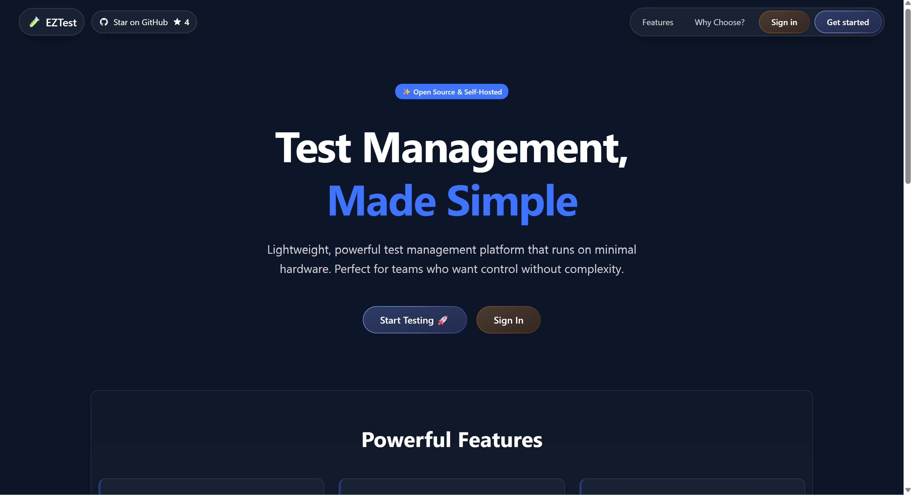
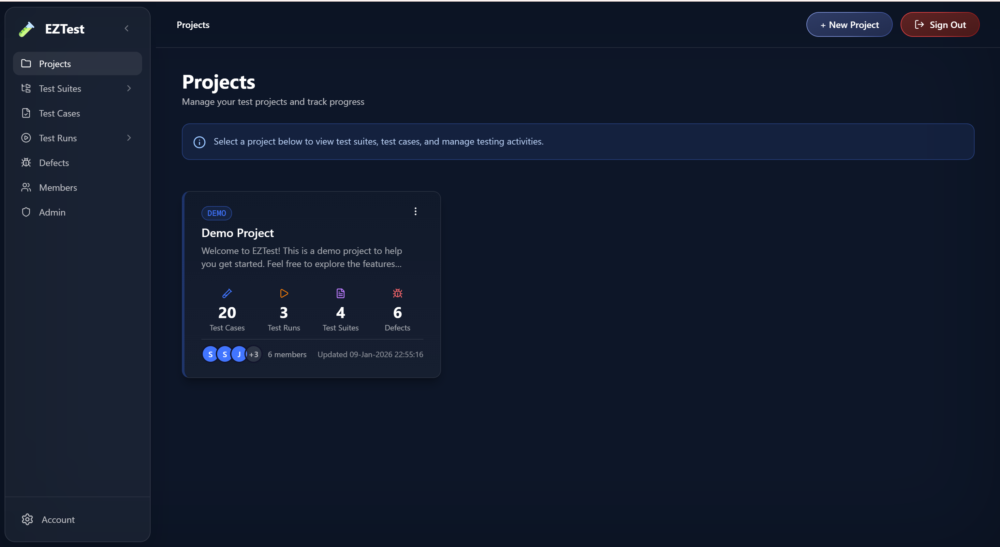
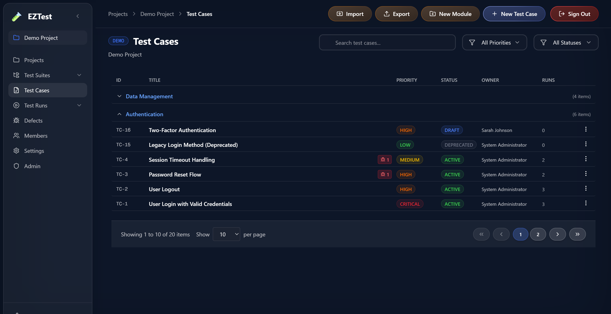
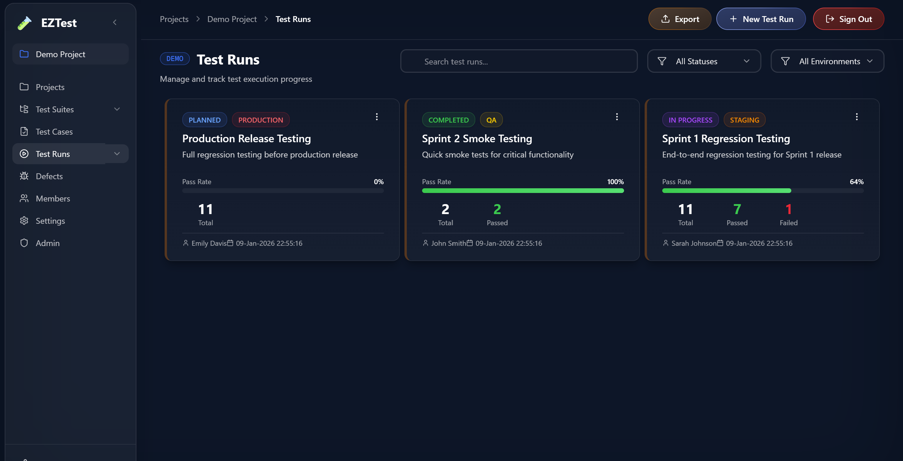
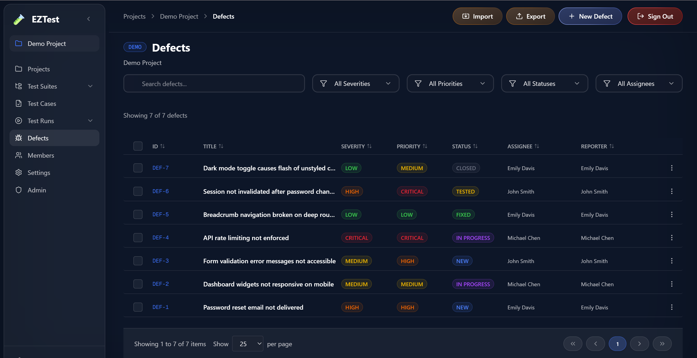

<div align="center">

# 🧪 EZTest

### セルフホスト可能なテスト管理プラットフォーム

*「SaaS税」を払わないテスト管理 — レンタルではなく、自分のものに。*

[](https://www.gnu.org/licenses/agpl-3.0)
[](https://nextjs.org/)
[](https://reactjs.org/)
[](https://www.typescriptlang.org/)

🌐 **[ライブデモ](https://eztest.houseoffoss.com/)** &nbsp;•&nbsp; 👥 **[ユーザーガイド](docs/USER_GUIDE.md)** &nbsp;•&nbsp; 📚 **[ドキュメント](./docs/README.md)** &nbsp;•&nbsp; 🗺️ **[ロードマップ](./ROADMAP.md)**

</div>

---

## 📑 目次

- [✨ 概要](#-概要)
- [🛡️ 思想](#️-思想saas税を打ち破る)
- [📸 スクリーンショット](#-スクリーンショット)
- [🎯 機能ステータス](#-機能ステータス)
- [⚠️ セキュリティに関する注意](#️-セキュリティに関する注意)
- [🚀 クイックスタート](#-クイックスタート)
- [💻 技術スタック](#-技術スタック)
- [📊 システム要件](#-システム要件)
- [🛠️ 開発](#️-開発)
- [📚 ドキュメント](#-ドキュメント)
- [🤝 コントリビューション](#-コントリビューション)
- [📄 ライセンス](#-ライセンス)
- [📞 サポート・お問い合わせ](#-サポートお問い合わせ)
- [🌟 謝辞](#-謝辞)

---

## ✨ 概要

**EZTest** は、**Next.js** で構築された軽量なオープンソースのテスト管理プラットフォームで、**セルフホスト**向けに設計されています。Testiny や TestRail といった商用ツールに代わる効率的な選択肢であり、**わずか 1 CPU コア・2GB RAM** という最小限のハードウェアで動作するよう最適化されています。

EZTest はモダンな UI と強力な機能を兼ね備えています。プロジェクト管理、テストの整理、実行トラッキング、チームコラボレーション — これらすべてを **Docker** で数分のうちにデプロイできます。

> 👥 **はじめての方へ** まずは [**ユーザーガイド**](docs/USER_GUIDE.md) をご覧ください。EZTest とは何か、どう使うのかを技術者でなくても分かるように解説しています。

| | |
|---|---|
| 📌 **現在のステータス** | 開発進行中（**v0.1.0**） |
| 🌐 **デモサイト** | [eztest.houseoffoss.com](https://eztest.houseoffoss.com/) |
| 📄 **ライセンス** | AGPL-3.0 |
| 👤 **メンテナー** | Philip Moses・Kavin（House of FOSS） |

---

## 🛡️ 思想：「SaaS税」を打ち破る

> かつてソフトウェアは「所有する道具」でした。しかし今では「レンタルするサブスクリプション」になっています。

今日のテスト管理ツールは、しばしば**過剰に高額化した、ただのスプレッドシート**に過ぎません。基本的な CRUD 操作のために **1 ユーザーあたり月額 20〜40 ドル**を請求します。AI コーディングエージェントの時代において、もはや正当化できない価格です。

**EZTest はシンプルな気づきから生まれました：**

> 💡 *AI エージェントが月額 20 ドルで、ソフトウェアをあっという間に作れる時代に、なぜたった 1 つのツールを借りるために 1 ユーザーあたり月額 20 ドルを払う必要があるのか？*

車輪の再発明をするつもりはありません。目指すのは、**凡庸で割高なソフトウェアの連鎖を断ち切ること**です。私たちは **Claude Code と Cursor** を活用して開発コストをほぼゼロまで圧縮し、その**「効率化の配当」**をそのままコミュニティに還元します。🎁

---

## 📸 スクリーンショット

<div align="center">

### 🏠 公開トップページ



### 🖥️ メインアプリケーション

| 📂 **プロジェクトダッシュボード** | 📝 **テストケース** |
|:---:|:---:|
|  |  |

| ▶️ **テストラン** | 🐞 **不具合トラッキング** |
|:---:|:---:|
|  |  |

</div>

---

## 🎯 機能ステータス

| 機能 | ステータス | 詳細 |
|---------|:------:|---------|
| 🔐 **認証・認可** | ✅ 完了 | メール／パスワード認証、RBAC、きめ細かい権限管理 |
| 👥 **ユーザー管理** | ✅ 完了 | CRUD、チーム管理、メンバーロール |
| 🧩 **モジュール** | ✅ 完了 | プロジェクトの整理、機能のグルーピング |
| 🗂️ **テストスイート** | ✅ 完了 | 実行用の階層的な整理 |
| 📝 **テストケース** | ✅ 完了 | 完全な CRUD、ステップ、優先度、ステータス |
| ▶️ **テストラン** | ✅ 完了 | 実行トラッキング、結果、進捗モニタリング |
| 📊 **テスト結果** | ✅ 完了 | 複数ステータス、コメント、所要時間トラッキング |
| 📎 **ファイル添付** | ✅ 完了 | S3 への直接アップロード、最大 500MB、署名付き URL |
| 💬 **コメント・コラボレーション** | ✅ 完了 | 不具合に関するディスカッション |
| 📈 **ダッシュボード・分析** | 🚧 進行中 | 基本的なメトリクスを提供 |
| 🔗 **要件トレーサビリティ** | 📋 計画中 | テストと要件の紐付け |
| 🔌 **API 連携** | 📋 計画中 | Jira、GitHub、Azure DevOps |
| ⚙️ **自動化連携** | 📋 計画中 | CI/CD、テストフレームワーク |

> **凡例：** ✅ 完了 &nbsp;•&nbsp; 🚧 進行中 &nbsp;•&nbsp; 📋 計画中

---

## ⚠️ セキュリティに関する注意

> 🚨 **重要：** 本プロジェクトはファイル添付のために **AWS S3 の認証情報** を必要とします。

🔒 **本物の AWS 認証情報を絶対にリポジトリへコミットしないでください！**

- ✅ `.env.local` は `.gitignore` に含まれており、コミットされません
- ✅ テンプレートとして `.env.example` を使用してください（プレースホルダーのみ）
- ✅ デプロイ時は環境変数または **AWS IAM ロール** を使用してください
- ✅ **S3 のみの権限**を持つ専用 IAM ユーザーを作成してください（[添付機能のドキュメント](./docs/features/attachments/README.md) を参照）
- ✅ 誤って漏洩した場合は **直ちに認証情報をローテーション** してください

---

## 🚀 クイックスタート

> ⚡ **最速で始める方法** — Docker で EZTest を試しましょう！

**必要なもの：** Docker と Docker Compose

```bash
# 1️⃣ リポジトリをクローン
git clone https://github.com/houseoffoss/eztest.git
cd eztest

# 2️⃣ 環境を設定
cp .env.example .env
# .env を自分の設定に合わせて編集

# 3️⃣ アプリケーションを起動
docker-compose up -d

# 4️⃣ データベースを初期化
docker-compose exec app npx prisma db push
docker-compose exec app npx prisma db seed

# 5️⃣ http://localhost:3000 を開く 🎉
```

### 🔑 デフォルトの管理者アカウント

| 項目 | 値 |
|-------|-------|
| 📧 **メールアドレス** | `admin@eztest.local` |
| 🔒 **パスワード** | `Admin@123456` |

> 💡 新しいアカウントを登録することもできます。また、シード実行**前**に環境変数 `ADMIN_EMAIL` と `ADMIN_PASSWORD` を設定すれば、管理者アカウントをカスタマイズできます。

> 📖 本番デプロイや高度な設定については [**DOCKER.md**](./DOCKER.md) を参照してください。

---

## 💻 技術スタック

| レイヤー | 技術 | バージョン |
|-------|-----------|:-------:|
| 🧱 **フレームワーク** | Next.js | 15.5.6 |
| ⚛️ **UI ライブラリ** | React | 19.1.0 |
| 📘 **言語** | TypeScript | 5.x |
| 🎨 **スタイリング** | Tailwind CSS | 4.x |
| 🧩 **UI コンポーネント** | Radix UI | Latest |
| 🗄️ **データベース** | PostgreSQL | 16 |
| 🔧 **ORM** | Prisma | 5.22.0 |
| 🔐 **認証** | NextAuth.js | 4.24.11 |
| 🔑 **パスワードハッシュ化** | bcryptjs | 3.0.2 |
| 📧 **メール** | Nodemailer | 6.10.1 |
| ✔️ **バリデーション** | Zod | 4.1.12 |
| 🎯 **アイコン** | Lucide React | 0.546.0 |
| 🐳 **デプロイ** | Docker & Docker Compose | Latest |

---

## 📊 システム要件

| スペック | 🟢 最小 | 🔵 推奨 | 🟣 本番 |
|--------------|:----------:|:--------------:|:------------:|
| 🧮 **CPU コア** | 1 | 2 | 4+ |
| 🧠 **RAM** | 2GB | 4GB | 8GB+ |
| 💾 **ストレージ** | 10GB | 20GB | 50GB+ |
| 🗄️ **データベース** | PostgreSQL 14+ | PostgreSQL 16 | PostgreSQL 16+ |
| 🟩 **Node.js** | 18.x | 20.x | 20.x LTS |

---

## 🛠️ 開発

> 🧑‍💻 **EZTest にコントリビュートしますか？** 以下の手順でローカル開発環境をセットアップしてください。

**必要なもの：** Node.js 18+、PostgreSQL 16

### ⚙️ セットアップ

```bash
# クローンして依存関係をインストール
git clone https://github.com/houseoffoss/eztest.git
cd eztest
npm install

# 環境を設定
cp .env.example .env
# DATABASE_URL やその他の変数を更新

# PostgreSQL を起動（自前のサーバーでも可）
docker-compose up -d postgres

# データベースをセットアップ
npx prisma generate
npx prisma db push
npx prisma db seed

# 開発サーバーを起動
npm run dev
# http://localhost:3000 を開く 🎉
```

### 📋 よく使うコマンド

```bash
npm run dev              # 🚀 Turbopack で開発サーバーを起動
npm run build            # 📦 本番用ビルド
npm run lint             # 🔍 コード品質チェック
npx prisma studio        # 🗃️ ビジュアルなデータベースエディタ
npx prisma generate      # 🔧 Prisma Client を生成
npx prisma db push       # 🔄 データベーススキーマを更新
npx prisma db seed       # 🌱 サンプルデータを追加
```

### 🔁 ワークフロー

1. ✏️ コード／スキーマを変更する
2. 🔄 スキーマを変更した場合：`npx prisma generate && npx prisma db push`
3. 🧪 http://localhost:3000 で動作確認する
4. 🔍 `npm run lint` を実行する
5. ✅ 変更をコミットする

> 📖 **開発者向け完全ガイド：** [開発環境セットアップ](./docs/contributing/development-setup.md) · [コードパターン](./docs/architecture/patterns.md)

---

## 📚 ドキュメント

**👥 ユーザー向け**
- [ユーザーガイド](./docs/USER_GUIDE.md) — 技術者でなくても分かる入門
- [Docker デプロイ](./DOCKER.md) — 本番セットアップ

**🧑‍💻 開発者向け**
- [ドキュメントホーム](./docs/README.md) — ドキュメント総合インデックス
- [アーキテクチャ](./docs/architecture/README.md) — システム設計とパターン
- [API ドキュメント](./docs/api/README.md) — 内部 API リファレンス

**🗺️ 計画**
- [ROADMAP](./ROADMAP.md) — 機能の進捗と今後の計画

---

## 🤝 コントリビューション

コントリビューションを ❤️ 歓迎します！次の流れでご協力いただけます。

1. 🍴 リポジトリを **Fork** する
2. 🌿 **フィーチャーブランチを作成** する（`git checkout -b feature/amazing-feature`）
3. ✨ コードパターンに沿って **変更を加える**
4. 🧪 **十分にテスト** する（`npm run lint` が通ることを確認）
5. 💾 **変更をコミット** する（`git commit -m 'Add amazing feature'`）
6. 🚀 **ブランチに push** する（`git push origin feature/amazing-feature`）
7. 📬 **プルリクエストを作成** する

### 📐 開発ガイドライン

- 📘 TypeScript のベストプラクティスに従う
- 🧩 既存のコンポーネントパターンを利用する
- 📝 意味のあるコミットメッセージを書く
- 📚 新機能にはドキュメントを更新する
- 🔍 PR を提出する前にすべての lint を通す

---

## 📄 ライセンス

本プロジェクトは **GNU Affero General Public License v3.0（AGPL-3.0）** の下でライセンスされています。

> ⚖️ **本ソフトウェアを改変してネットワークサービスとして運用する場合は、AGPL の要求に従い、そのサービスの利用者に対して対応する完全なソースコードを提供しなければなりません。**

詳細は [**LICENSE**](./LICENSE) ファイルを参照してください。

**Copyright © 2025 Belsterns**

---

## 📞 サポート・お問い合わせ

| | |
|---|---|
| 🌐 **デモ** | [eztest.houseoffoss.com](https://eztest.houseoffoss.com/) |
| 📚 **ドキュメント** | [/docs](./docs/README.md) |
| 🐛 **不具合報告** | 上部の GitHub Issues タブをご利用ください |

### 👤 メンテナー

- **Philip Moses** — 📧 philip.moses@belsterns.com · 🏢 House of FOSS
- **Kavin** — 📧 kavin.p@belsterns.com · 🏢 House of FOSS

---

## 🌟 謝辞

モダンなオープンソース技術で構築されています：

- [Next.js](https://nextjs.org/) — React フレームワーク
- [Prisma](https://www.prisma.io/) — データベース ORM
- [NextAuth.js](https://next-auth.js.org/) — 認証
- [Radix UI](https://www.radix-ui.com/) — アクセシブルな UI コンポーネント
- [Tailwind CSS](https://tailwindcss.com/) — ユーティリティファースト CSS
- [Lucide](https://lucide.dev/) — アイコンライブラリ

---

<div align="center">

**🧪 EZTest** — すべての人にテスト管理を 🚀

⭐ *このプロジェクトが役に立ったら、ぜひスターをお願いします！*

</div>
